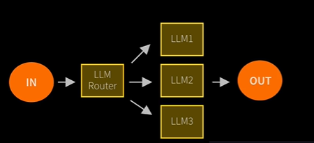
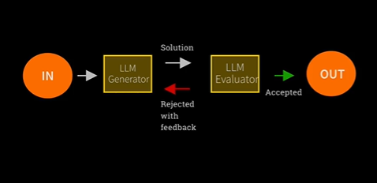

### 1. Install Cursor

### 2. Install uv through powershell

    powershell -ExecutionPolicy ByPass -c "irm https://astral.sh/uv/install.ps1 | iex"

    Check the version of uv
    uv --version

    Sync the project with uv sync command it will install all the requirement packages.
    uv sync

### 3. Make an .env file and set the api key from openai platform

    OPENAI_API_KEY = your open api key write here

### 4. Setup the environment venv file before write the code.

### 5. Write the first code, the plan is to ask a question and then answer from openai and then again ask on that question

    from dotenv import load_dotenv

5.1. Load the .env file here

    load_dotenv(override=True)

5.2. Check the key - if you're not using OpenAI, check whichever key you're using! Ollama doesn't need a key.

    import os
    openai_api_key = os.getenv('OPENAI_API_KEY')

    if openai_api_key:
        print(f"OpenAI API Key exists and begins {openai_api_key[:8]}")
    else:
        print("OpenAI API Key not set - please head to the troubleshooting guide in the setup folder")

5.3. # And now - the all important import statement

# If you get an import error - head over to troubleshooting in the Setup folder

# Even for other LLM providers like Gemini, you still use this OpenAI import - see Guide 9 for why

        from openai import OpenAI

5.4. # make an instance of openAI

        openai = OpenAI()

5.5 Make a question and for get message define the role and content. it is kind of api call

        question = "Please propose a hard, challenging question to assess someone's IQ. Respond only with the question."
        messages = [{"role": "user", "content": question}]

5.6 # ask it - this uses GPT 4.1 mini, still cheap but more powerful than nano

        response = openai.chat.completions.create(
            model="gpt-4.1-mini",
            messages=messages
        )

        question = response.choices[0].message.content

        print(question)

# What is Agent ?

    AI agents are programs where LLM outputs control the workflow

    In practice, describes an AI solution that involves any or all of these:

    1. Multiple LLM calls
    2. LLMs with ability to use Tools
    3. An environment where LLMs interact
    4. A planner to coordinate activites
    5. Autonomy

    Anthropic distinguishes two types:
    1. Workflows are system where LLMs and tools are orchestrated through predefined code paths.

    2. Agents are systems where LLMs dynamically direct their own processes and tool usage, maintaining control over how they accomplish tasks

# Essential LLM workfkow design patterns for building Robust AI system

    1. Prompt Chaining
        Decompose into fixed sub-tasks

  

    2. Routing
    Direct an input into a specialized sub-task, ensuring sepration of concern

    The second design pattern is called routing and this is where an input comes in.
    And an LLM has the task of deciding which of multiple possible models are selected to carry out this function.

    And the idea is that you might have specialist models in here. They're shown by LLM one, two and three, and they're each good at different tasks. And the router's job is to classify the task, understand which of the specialists will be best equipped to tackle this task. It allows for separation of concerns being able to have different LLMs that have different levels of expertise, and have an LLM decide how to route to those experts.

  

    3. PARALLELIZATION
    Breaking down tasks and running multiple subtasks concurrently

  

    4. ORCHESTRATOR-WORKER
    Complex tasks are broken down dynamically and combined.

  

    This is when a difficult, challenging task is broken down and recombined.

    The key point is that this is exactly like the prior design pattern, except it's no longer code that's doing the orchestration. It's an LLM. So you are using a model to break down a complex task into smaller steps and then you are using a model to combine the results.

    And so this is a much more dynamic kind of system where the orchestrator can choose how to divvy up the task.

    Generally the idea here LLM breaks down the task LLMs carry out each expert task, LM Synthesizes the task for anoutput that is pattern for the orchestrator worker.

    5. Evalutor-optimizer
    LLM output is validated by another

    it is called an evaluator optimized by anthropic. I tend to call them just evaluators or validation agents.

    You have an LM that's doing your job. Lets call it LM generator. and its doing something and it comes up with a solution shown in this white arrow here. And you have a second LM that's playing the role of evaluator. It's there to check the work of the first LM. And it's given any extra information, any context, everything to arm itself to, to not be trying to generate content, but check the work of a prior LM. And based on that it can choose to either accept or reject the work. If it accepts it, then that's it goes to the output. If it rejects it it should come up with a reason. And the rejection and the reason goes back to the LM generator. And that can then choose to come up with another solution which comes back here. And so you can see this, this sort of feedback loop setup. It's very powerful.

  

### Week 1 Lab 3:

### Lab 3:

Here we have one linkedin profile and summary. Now we need to take answer from chatgpt api and then evaulate from gemini.

Step 1 :

First load the library and .env file

    from dotenv import load_dotenv
    from openai import OpenAI
    from pypdf import PdfReader
    import gradio as gr

Here gradio is a framework where it provide us the message frontend like chatgpt.

<textarea rows="10" style="width:100%; border:2px solid #ccc; border-radius:6px; padding:10px;">
</textarea>
