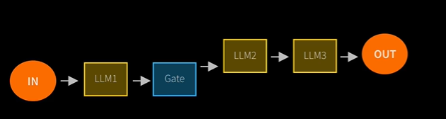

### 1. Install Cursor

### 2. Install uv through powershell

    powershell -ExecutionPolicy ByPass -c "irm https://astral.sh/uv/install.ps1 | iex"

    Check the version of uv
    uv --version

    Sync the project with uv sync command it will install all the requirement packages.
    uv sync

### 3. Make an .env file and set the api key from openai platform

    OPENAI_API_KEY = your open api key write here

### 4. Setup the environment venv file before write the code.

### 5. Write the first code, the plan is to ask a question and then answer from openai and then again ask on that question

    from dotenv import load_dotenv

5.1. Load the .env file here

    load_dotenv(override=True)

5.2. Check the key - if you're not using OpenAI, check whichever key you're using! Ollama doesn't need a key.

    import os
    openai_api_key = os.getenv('OPENAI_API_KEY')

    if openai_api_key:
        print(f"OpenAI API Key exists and begins {openai_api_key[:8]}")
    else:
        print("OpenAI API Key not set - please head to the troubleshooting guide in the setup folder")

5.3. # And now - the all important import statement

# If you get an import error - head over to troubleshooting in the Setup folder

# Even for other LLM providers like Gemini, you still use this OpenAI import - see Guide 9 for why

        from openai import OpenAI

5.4. # make an instance of openAI

        openai = OpenAI()

5.5 Make a question and for get message define the role and content. it is kind of api call

        question = "Please propose a hard, challenging question to assess someone's IQ. Respond only with the question."
        messages = [{"role": "user", "content": question}]

5.6 # ask it - this uses GPT 4.1 mini, still cheap but more powerful than nano

        response = openai.chat.completions.create(
            model="gpt-4.1-mini",
            messages=messages
        )

        question = response.choices[0].message.content

        print(question)

# What is Agent ?

    AI agents are programs where LLM outputs control the workflow

    In practice, describes an AI solution that involves any or all of these:

    1. Multiple LLM calls
    2. LLMs with ability to use Tools
    3. An environment where LLMs interact
    4. A planner to coordinate activites
    5. Autonomy

    Anthropic distinguishes two types:
    1. Workflows are system where LLMs and tools are orchestrated through predefined code paths.

    2. Agents are systems where LLMs dynamically direct their own processes and tool usage, maintaining control over how they accomplish tasks

# Essential LLM workfkow design patterns for building Robust AI system

    1. Prompt Chaining
        Decompose into fixed sub-tasks

    

    2.
